## Quick Review on Sparky Linux

### Background
Its been a while since I have done any Linux Distro review, the review of Sparky linux has been long time pending. While this is not the latest version of Sparky linux but given its light weight nature I feel what every I have experienced on Sparky Linux still holds for latest version.

## Introduction
In this review I used Sparky 5.10.1 lxqt version which was the first one offering Lxqt since I have used Lubuntu. I tested this distro in Virtualbox with 4gb of RAM and booted it with traditional BIOS config though Sparky also support UEFI natively out of the box. And since it also support 32 bit UEFI boot for a X86_64 architecture I am also planning to test it out on my humble Acer One Laptop.

## First Impressions

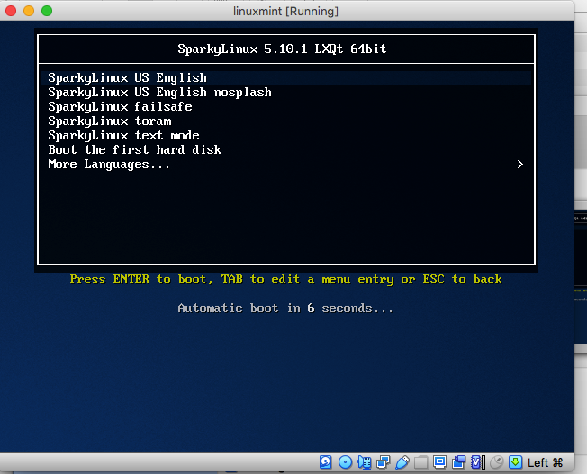

The boot flash screen was uneventful where I used "Sparky Linux in English" and was greeted with a blue Sparky Linux animated screen which was better that what I expected from the Distro. Though the look and feel was more from Early 2008-10 than anything current. 

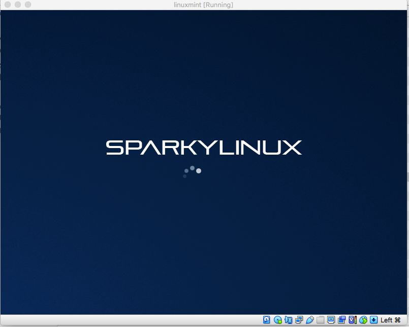

The same feel also was reflected when I got to the desktop. The desktop resembled me more of Windows 7 than Windows XP and hence while looking dated me feel at home. 

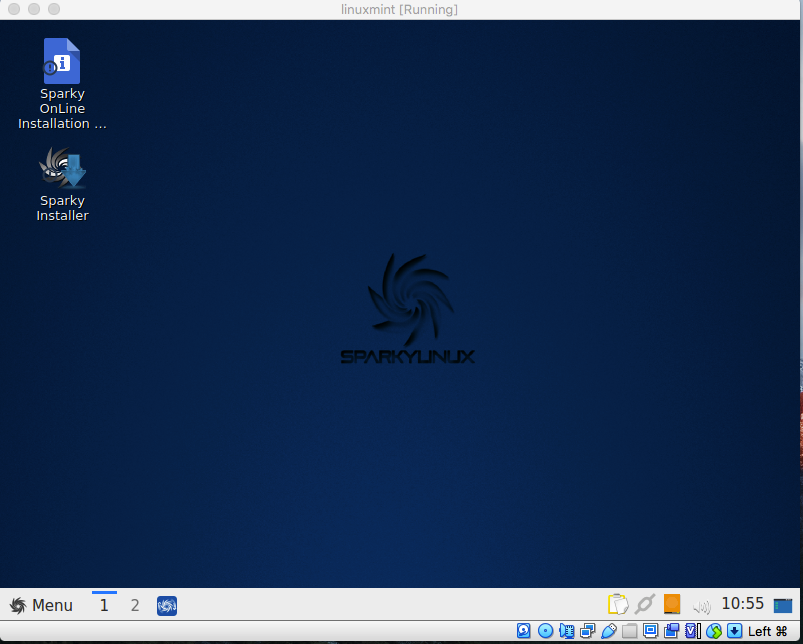

The Desktop is LXQt based which I have been using for last few months, hence I like it even more and comfortable using it. While anyone who does Distro hopping or review may like to approach a Linux OS with a open mind but when you find something that you have been using for a while making direct comparisons and trying to find parallels is expected. 

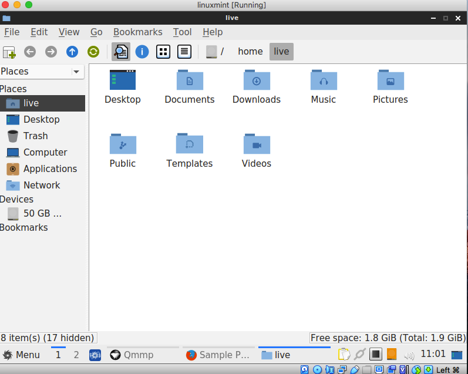

As I have been Lubuntu, it was natural for me to compare the desktop look and feel of Sparky Linux, and I was happy with the Desktop look and feel and using it.

## Positives

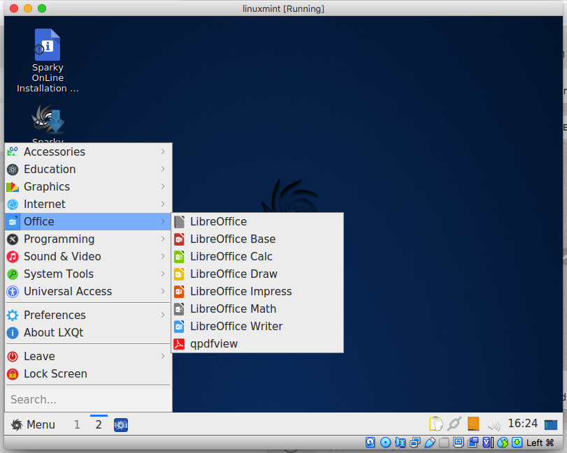

Sparky is loaded with Apps that makes it an ideal Daily driver and a great light weight Linux alternative to something like Windows 10 or Windows 7. 

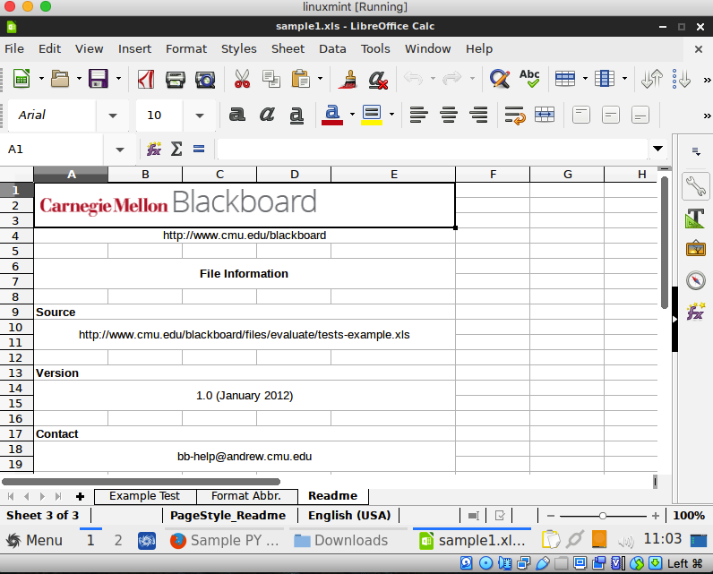

Its fully loaded with LibreOffice Apps which based on my experience works good with most of the document formats. One thing to note though is when I have tried running LibreOffice on my 2gb Acer One, I had mixed experiences, I am not sure if its because of Lubuntu or because of the RAM size which is obviously a limitation.

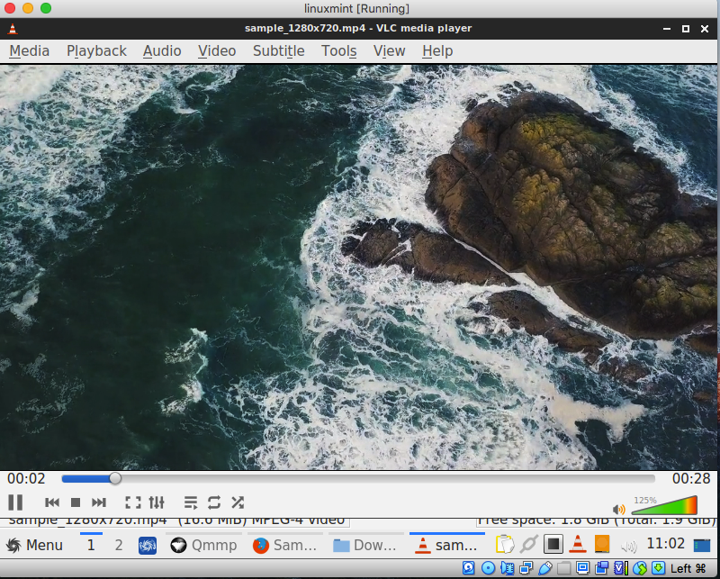

VLC, Qmmp and LxImage are good for multimedia and graphics applications and worked fine in the limited Virtual server environment.

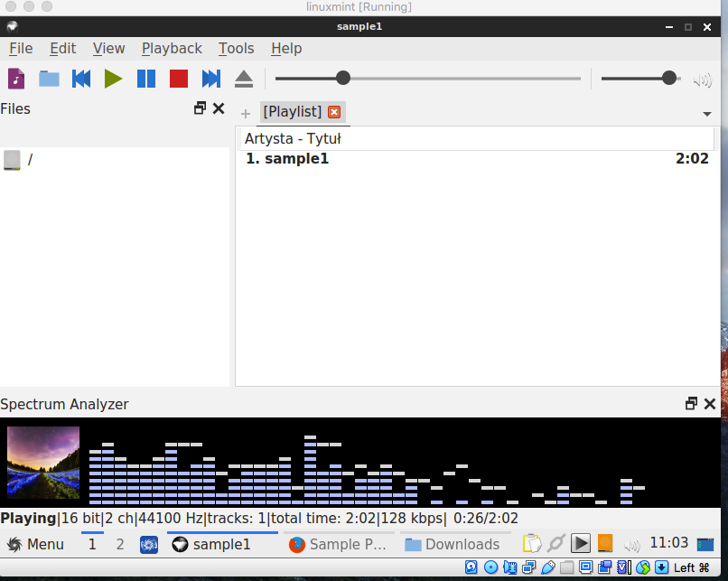

For me the highlight was its rich set of systems tools for making live CDs, USB formatter, gparted and Timeshift which are really helpful tools for anyone tikerer like me who wants more from a Linux distro and wants to explore more.

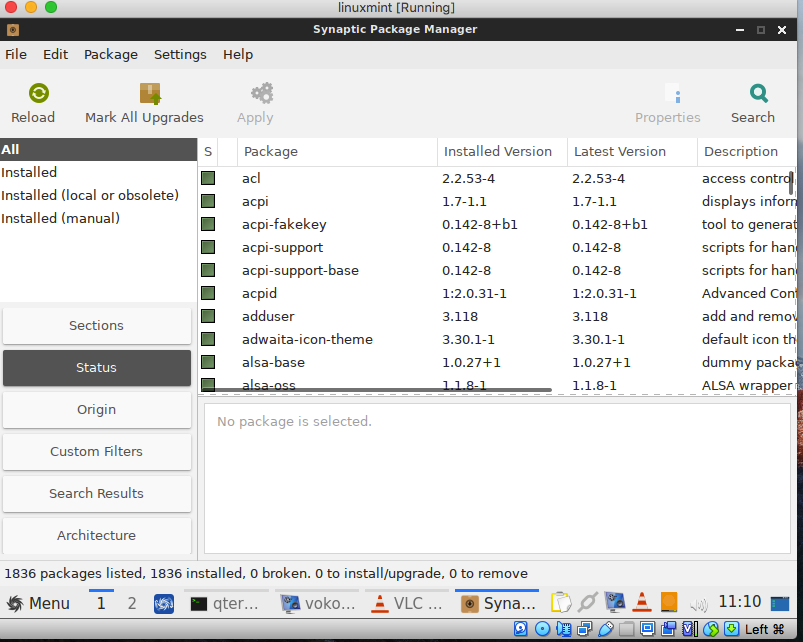

As its based on Debian, the rich repo of Debian apps are available via Synaptic package manager and one can also use the apt command line package manager to download from Debian package repository.

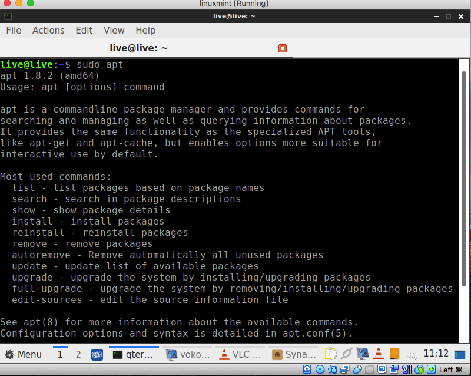

## Negatives

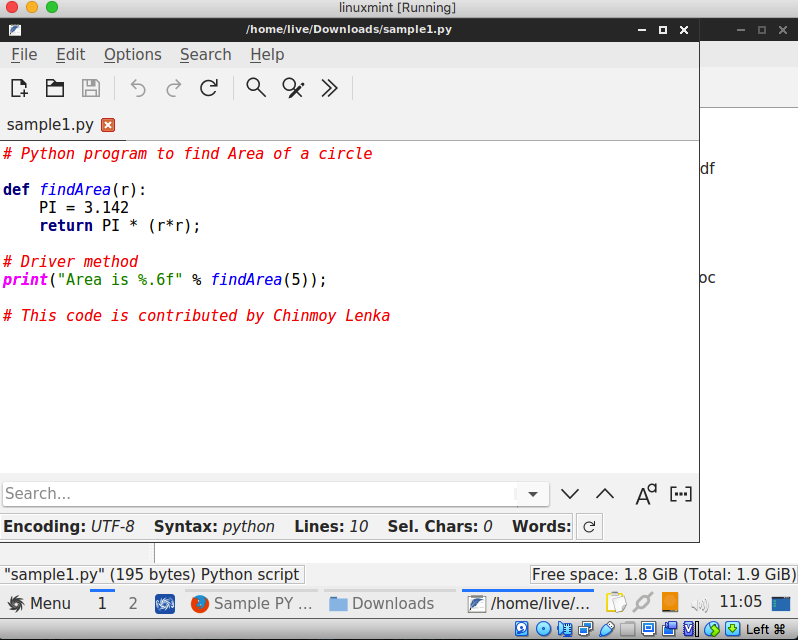

For me the let down was the lack of robust programming editor and bland Featurepad was not something I would like to use in the long run. 

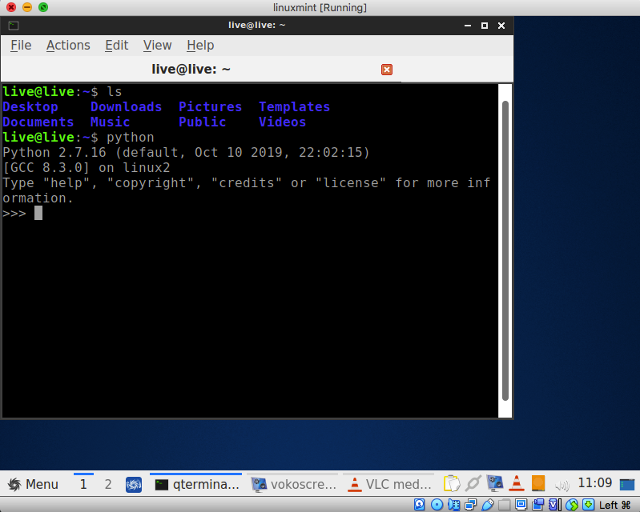

Another let down was the lack of a good terminal app. 

The default terminal did the job but this is something I also have complains about in Lubuntu. Another issue which while may not be evident in Virtualbox but while installing Debian distributions on my Acer One has been the lack of drivers for my specific laptop and that is something which I never had with any Ubuntu based OS. 

## Final Thoughts

Sparky was a very interesting OS and I had lot of hopes using it, this may be one of the few distributions that I can try for my Acer One laptop but its Debian base is something for me to worry about. Overall this is a good OS which can be a light weight replacement for your Windows XP or Windows 7 desktop without impacting performance.
